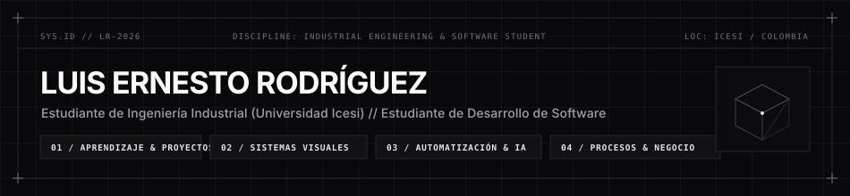
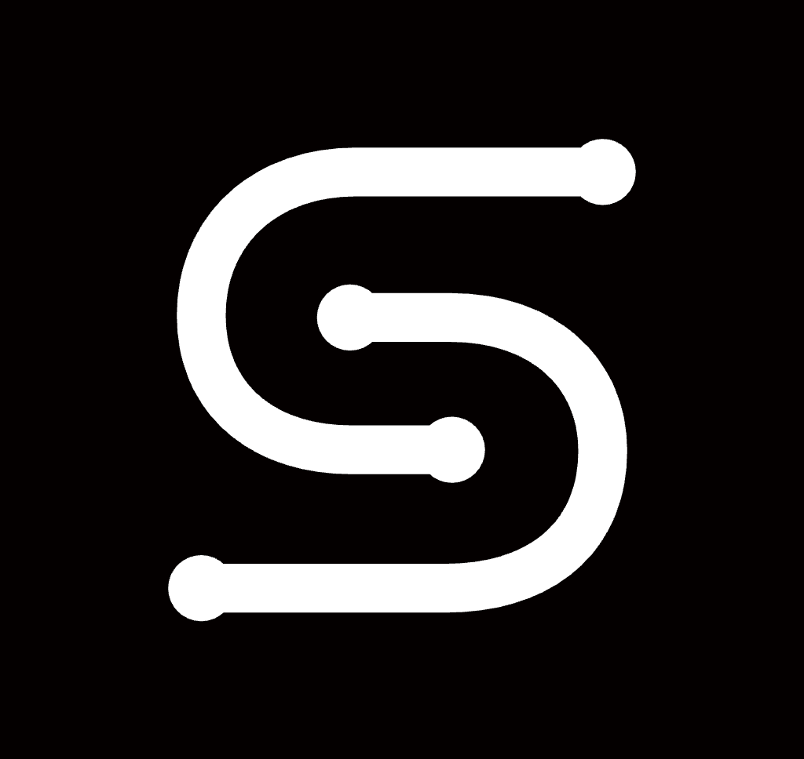
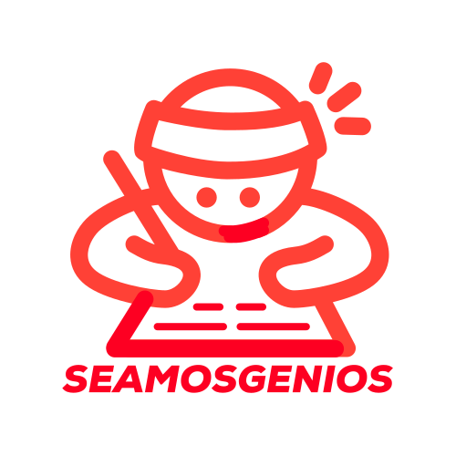
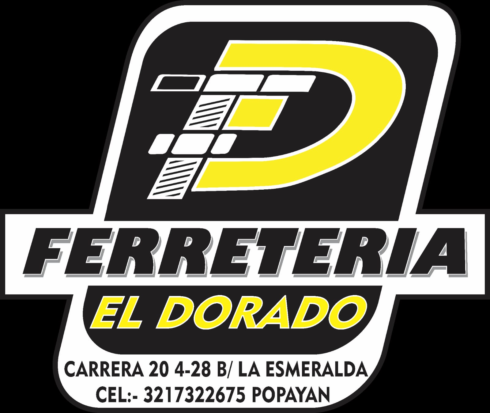

  

 

  
  

---

### Sobre Mi

Soy estudiante de **Ingeniería Industrial en la Universidad Icesi** y **estudiante de desarrollo de software** enfocado en aprender construyendo productos digitales que conecten tecnología, negocio y experiencia de usuario.

Me interesa convertir problemas reales en soluciones de software funcionales, participando en todo el proceso: entender el problema, diseñar la solución, desarrollar el producto, desplegarlo y mejorar a partir del uso real.

Actualmente trabajo en proyectos relacionados con **SaaS, aplicaciones web, automatización e inteligencia artificial**, mientras continúo desarrollando mis conocimientos en ingeniería de software, arquitectura y producto.

---

### Proyectos Destacados

<table>
  <tr>
    <td width="50%" valign="top">
      

        
      

       
      <h4>01 // Sketion</h4>
      
<strong>Visual Knowledge Workspace</strong>

      
Espacio visual de trabajo para aprender, estructurar información, modelar sistemas y documentar conocimiento. Permite integrar documentos PDF, fórmulas LaTeX, diagramas Mermaid, tablas de datos y notas Markdown en un único espacio visual.

      

        
        
        
        
        
      

      

        <a href="https://sketion.vercel.app">[ Demo ]</a> &middot;
        <a href="https://sketion-home.vercel.app">[ Sitio Web ]</a> &middot;
        <a href="https://github.com/luisrodriguez-rgb/Sketion">[ Repositorio ]</a> &middot;
        <a href="https://docs-sketion.vercel.app">[ Documentación ]</a>
      

    </td>
    <td width="50%" valign="top">
      

        
      

       
      <h4>02 // Sketion Diagram Design Engine</h4>
      
<strong>Motor Visual para Generar Diagramas</strong>

      
Proyecto enfocado en transformar ideas, información estructurada y prompts en representaciones visuales organizadas, automatizando decisiones sobre jerarquía, relaciones, distribución espacial, composición y legibilidad.

      

        
        
        
        
        
      

      

        <a href="https://github.com/luisrodriguez-rgb/Sketion-Diagram-Design-Engine-">[ Repositorio ]</a>
      

    </td>
  </tr>
  <tr>
    <td width="50%" valign="top">
      <h4>03 // El Sabio</h4>
      
<strong>Software para Restaurantes</strong>

      
Plataforma web para restaurantes y gastrobares para gestionar reservas, disponibilidad de mesas y la operación diaria desde un solo lugar, reduciendo procesos manuales y evitando sobreventas.

      

        
        
        
        
      

      

        <a href="https://produccion-nine.vercel.app/index.html">[ Demo ]</a> &middot;
        <a href="https://github.com/luisrodriguez-rgb/El-Sabio">[ Repositorio ]</a>
      

    </td>
    <td width="50%" valign="top">
      

        
      

       
      <h4>04 // SEAMOS GENIOS</h4>
      
<strong>Plataforma Educativa &amp; Automatización</strong>

      
Desarrollo y mantenimiento de soluciones tecnológicas para organización de preparación académica. Automatización de procesos, desarrollo web e integración de herramientas digitales.

      

        
        
        
        
      

      

        <strong>Organización:</strong> SEAMOSGENIOS S.A.S.
      

    </td>
  </tr>
  <tr>
    <td width="50%" valign="top">
      

        
      

       
      <h4>05 // Ferretería El Dorado</h4>
      
<strong>Aplicación Web Comercial &middot; Popayán</strong>

      
Presencia digital y catálogo web desarrollado para Ferretería El Dorado en Popayán, con interfaz en React y arquitectura con backend y base de datos MySQL.

      

        
        
        
      

      

        <a href="https://ferreter-a-el-dorado-1040287131233.us-west2.run.app/">[ Demo ]</a> &middot;
        <a href="https://github.com/luisrodriguez-rgb/Ferreter-a-el-Dorado">[ Repositorio ]</a>
      

    </td>
    <td width="50%" valign="top">
      <h4>06 // SH Store</h4>
      
<strong>E-commerce</strong>

      
Proyecto enfocado en el aprendizaje del comercio electrónico y en desarrollar una experiencia de compra moderna utilizando tecnologías actuales de JavaScript.

      

        
        
      

      

        <em>En desarrollo</em>
      

    </td>
  </tr>
</table>

---

### Tecnologías

#### Lenguajes

  
  
  
  

#### Frontend

  
  

#### Backend &amp; Datos

  
  
  

#### Herramientas &amp; Desarrollo

  
  
  
  

#### Áreas de Interés &amp; Exploración

  
  
  
  
  

---

### Registro de Contribuciones

  <picture>
    <source media="(prefers-color-scheme: dark)" srcset="https://raw.githubusercontent.com/luisrodriguez-rgb/luisrodriguez-rgb/output/github-contribution-grid-snake-dark.svg" />
    <source media="(prefers-color-scheme: light)" srcset="https://raw.githubusercontent.com/luisrodriguez-rgb/luisrodriguez-rgb/output/github-contribution-grid-snake.svg" />
    
  </picture>

---

### Actualmente estoy trabajando en

* Desarrollo y validación de productos SaaS.
* Aplicaciones web para negocios.
* Automatización de procesos.
* Aplicaciones con inteligencia artificial.
* Sistemas para transformar información en representaciones visuales.
* Herramientas de productividad y educación.
* Experimentos relacionados con producto, tecnología y modelos de negocio.

---

### Objetivos para 2026

* Lanzar y validar una SaaS propia.
* Construir un portafolio sólido de productos y proyectos.
* Profundizar en arquitectura de software.
* Mejorar mis conocimientos de DevOps y Cloud Computing.
* Desarrollar aplicaciones utilizando inteligencia artificial de forma práctica.
* Trabajar con usuarios reales y validar productos en el mercado.
* Contribuir a proyectos Open Source.

---

  
    
  <strong>Luis Ernesto Rodríguez</strong> 
  Estudiante de Ingeniería Industrial &middot; Estudiante de Desarrollo de Software &middot; Emprendedor
    
  <em>"Construyendo soluciones que conectan tecnología, negocio y experiencia de usuario."</em>

